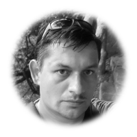

## .about us

yttro is a consulting, research, software and hardware engineering company offering a wide range of expertise. We have worked on projects for top companies and institutions:

* Google
* NVIDIA
* IBM
* ESET
* Novomatic
* Tatra banka
* Slovak Academy of Sciences
* Max Planck Institute

We have experience with software engineering, devops, systems programming, embedded development, hardware design and more. We are excited about projects in domains like game AI, machine learning, functional programming, computer vision, IoT.

## .our mission

We love to engage in risky research projects, being innovative, creative and to build new extraordinary applications. Are you an entrepreneur with a business opportunity, but need a team of experts to materialize your ideas into a working product in a short time? Are you a company that needs to hire an agile team with broad skillset to work on a project that you don’t have the capacity or expertise for? Tell us about your ideas and we can find a way how technology can leverage your business.

## .people

A company is only as extraordinary as its people are. Our teams consists of software developers and industry veterans with tens of years of collective experience and a multitude of delivered projects. There are researchers with PhDs in physics and automation among us.

<table>
<tr><td width="100px">   </td><td> Viktor Bachraty Machine learning researcher Viktor worked for a variety of companies ranging from garage startups to multinationals. He designed a pattern matching engine for ESET antivirus that significantly improved scanning speed. He turned his interest in fiddling with embedded HW into a full time job when he developed a USB dongle from scratch to secure transactions for a gambling company. Later he switched to working on large scale clusters and virtualization at Google. Currently, he is most excited about the advancements in machine learning. He is working with a research group focusing on deep learning applications for natural language processing. In his free time, he enjoys practicing foreign language skills and outdoor activities in nature. </td></tr>
<tr><td width="100px">   </td><td> Martin Kutny C++, Qt, UI and CGI Martin specializes in building cross-platform desktop, embedded and IoT software solutions and touch UIs. His preferred tools are C++, Java and the Qt framework. He has worked in varied environments and industries ranging from banking, energy sector, to gambling. He has seen many projects from the drawing board through live operations and is therefore well versed in all aspects of the software project lifecycle. Martin holds a master’s degree in computer science. In his spare time he creates 3D engines and hacks on virtual reality. He is a gamer, sci-fi fan, nature lover and general geek. </td></tr>
<tr><td width="100px">   </td><td> Michal Bachraty R&D consultant Michal designed a small cross platform library called Mikrix which is used for rapid application and IoT development. He worked for ESET, where he developed Cisco NAC & Microsoft NAP support. He also participates in Linux kernel driver development - mainly audio drivers for TI Omap processors. Many of his measurement applications are used in Slovak Academy of Sciences. He is an astronomy & space enthusiast currently studying general astronomy & radar technologies. As home hobby project he made his own bluetooth power socket and home control heating unit combining solar, biomass & gas energy source. </td></tr>
<tr><td width="100px">  </td><td> Michal Kobza Software analyst, programmer Miso is a long-running programmer from the ZX Spectrum, Amiga and Atari era. His passion for computer games let him to learn variety of technologies and programming languages. He has a deep experience with game design, A.I. and networking. He designed and developed software framework for game mechanics and probability logic of slot and bingo machines, with support for wide range of devices – from custom USB sticks with 32bit AVR micro-controller and crypto-authentication chip to 64bit SaaS server stations. He is experienced in functional programming focusing on Erlang/OTP. Currently, he spends his free time on indie game projects. He likes hiking and learning about history, politics and society. </td></tr>
<tr><td width="100px">   </td><td> Ondrej Hirjak IT Consultant Ondrej is a seasoned software engineer and IT consultant. His expertise stems from working on many projects, ranging from low-level kernel drivers and GPU computations through high-speed peer-to-peer networks to enterprise banking and gaming applications. As a consultant he focuses on high-level architecture and design. He is keen on taking ownership and delivering the project from start to finish, covering the whole software project lifecycle. Ondrej holds a master’s degree in computer science. In his spare time, when not experimenting with new technologies, he enjoys spending time with his family. </td></tr>
</table>

## .contact

enquire [at] yttro [dot] sk
